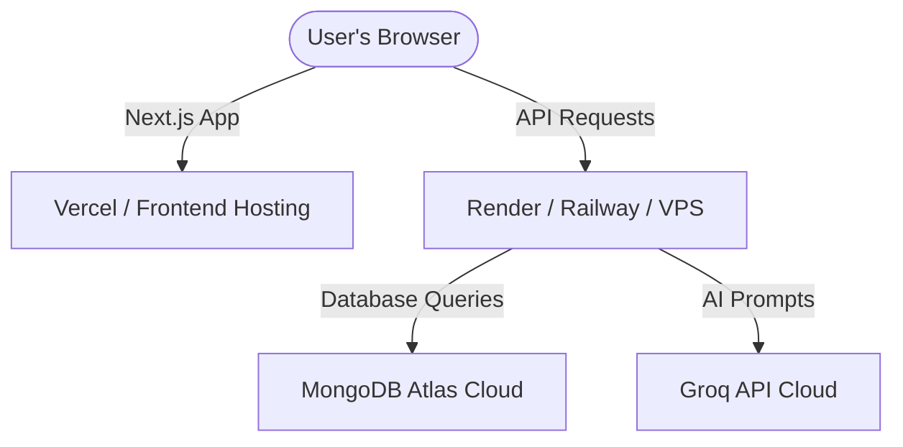

# SahayakAI Deployment Guide

This guide describes how to deploy the **SahayakAI** application to production environment.

## Overview of the Architecture



To deploy this application, you will need:
1. A MongoDB Database (e.g., **MongoDB Atlas**)
2. A Python Hosting Service for the FastAPI backend (e.g., **Render** or **Railway**)
3. A Frontend Hosting Service for Next.js (e.g., **Vercel**)

---

## Step 1: Database Setup (MongoDB Atlas)

1. Sign up/Log in to [MongoDB Atlas](https://www.mongodb.com/cloud/atlas).
2. Create a free shared cluster.
3. Under **Database Access**, create a database user with read/write privileges.
4. Under **Network Access**, whitelist `0.0.0.0/0` (or add the IP addresses of your backend server).
5. Click **Connect** -> **Connect your application** and copy the URI string. It will look like this:
   `mongodb+srv://<username>:<password>@cluster0.xxxx.mongodb.net/?retryWrites=true&w=majority`

---

## Step 2: Deploying the Backend (FastAPI on Render)

[Render](https://render.com) is a great choice for hosting Python/FastAPI web services.

1. Create a Render account and connect your GitHub repository.
2. Click **New +** and select **Web Service**.
3. Select the `SahayakAI` repository.
4. Configure the Web Service settings:
   - **Name**: `sahayak-backend`
   - **Environment**: `Python 3`
   - **Root Directory**: `backend` (Important: points to the backend sub-folder)
   - **Build Command**: `pip install -r requirements.txt`
   - **Start Command**: `python run.py` (or `uvicorn backend.app.main:app --host 0.0.0.0 --port 8000`)
5. Open **Advanced** -> **Environment Variables** and add:
   - `MONGODB_URI` = `mongodb+srv://<username>:<password>@cluster0.xxxx.mongodb.net/sahayak_ai?retryWrites=true&w=majority`
   - `DATABASE_NAME` = `sahayak_ai`
   - `GROQ_API_KEY` = `your-production-groq-api-key`
   - `GROQ_MODEL` = `llama3-70b-8192`
6. Click **Create Web Service**. Render will build and deploy your backend. Take note of the live URL (e.g., `https://sahayak-backend.onrender.com`).

---

## Step 3: Configuring Frontend to connect to Production Backend

Before deploying the frontend, update the API client URL to point to your live backend.

1. Open the file [frontend/src/lib/api.ts](file:///d:/projects/SahayakAI/frontend/src/lib/api.ts).
2. Modify line 2 to dynamically select between local development or production backend:
   ```typescript
   const BACKEND_URL = process.env.NEXT_PUBLIC_API_URL || "http://localhost:8000/api";
   ```
   *(Alternatively, configure it inside a `.env` file).*

---

## Step 4: Deploying the Frontend (Next.js on Vercel)

[Vercel](https://vercel.com) is the creator of Next.js and provides the easiest deployment flow.

1. Create a Vercel account and connect your GitHub account.
2. Click **Add New** -> **Project**.
3. Import the `SahayakAI` repository.
4. In the configuration window:
   - **Framework Preset**: `Next.js`
   - **Root Directory**: `frontend` (Important: points to the frontend sub-folder)
5. Under **Environment Variables**, add the environment variable linking to the backend API:
   - **Key**: `NEXT_PUBLIC_API_URL`
   - **Value**: `https://sahayak-backend.onrender.com/api` (use your live backend URL from Step 2)
6. Click **Deploy**. Vercel will build and launch your application.

---

## Step 5: Test Verification

1. Once both deployments are completed successfully, visit your live Vercel URL.
2. Open the browser console and check if the dashboard correctly loads the schemes database.
3. Test a mock document upload or OCR verification step to confirm file handling.
